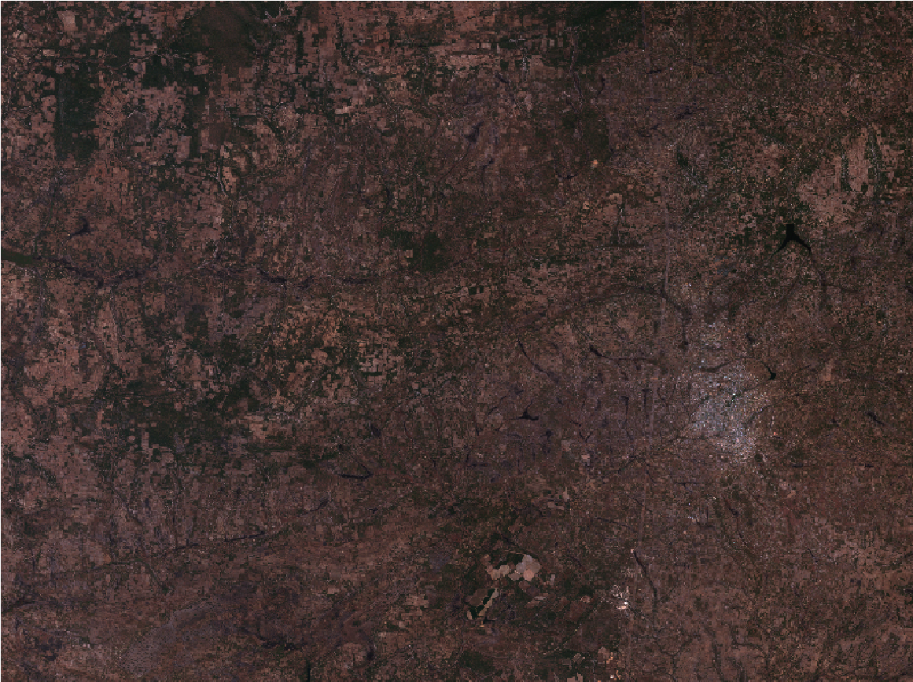
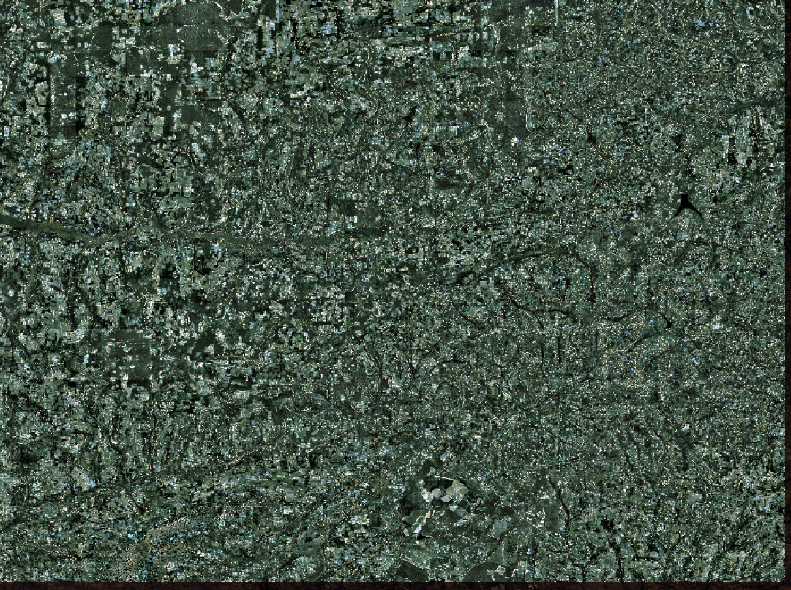

# Applying Super-Resolution to Sentinel 2 Imagery
### Alexander Vu and Ben Gaskill

## Description:
The goal of our project is to research, adapt, and fine-tune super-resolution deep learning frameworks to resample Sentinel-2 imagery from its native resolution of 10 meters up to 1.5 meters per pixel. Our main focus is on the WorldStrat super-resolution model, which we tested using multi-temporal stacks of input imagery for 6 selected sites across Zambia. 

Please refer to  for the full description of our project.

## Visualization of Data and Results:  
Please refer to the  notebook for dynamic visualizations (as well as our . Below is a static visualization of our inputs and outputs.  
___

___
### Input: Sentinel 2 (10 meter resolution)  
  
___
### Output 1: Super Resolution (1.5 meter resolution, Per-Band Normalization)  

#### A closer look:  
  

___
### Output 2: Super Resolution (1.5 meter resolution, Cross-Band Normalization)  
